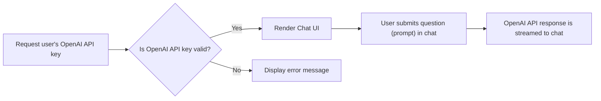

# Local_ChatGPT_Streamlit

This project aims to create a Local ChatGPT with Streamlit

**Topics**

1. [Overview](#overview)
2. [Goals](#goals)
3. [Scope and Context](#scope-and-context)
4. [System Design](#system-design)
5. [Alternatives Considered](#alternatives-considered)
6. [Learning Logs](#learning-logs)
7. [Resources](#resources)

---

## Overview

### Problem Statement

I'm a ChatGPT Plus subscriber, but I've realized that in the past few months I haven't being using ChatGPT enough to
justify the 20 USD/month subscription.

OpenAI offers an API to support the `Pay As You Go` model, which I believe is the best option for me.

### OpenAI API Pricing

| Model  | Context Length | Price: Input / 1K tokens | Price: Output / 1K tokens |
|--------|----------------|--------------------------|---------------------------|
| gpt3.5 | 4K  tokens     | 0.0015 USD               | 0.002 USD                 |
| gpt3.5 | 16K tokens     | 0.003  USD               | 0.004 USD                 |
| gpt4   | 8K  tokens     | 0.03   USD               | 0.06  USD                 |
| gpt4   | 32K tokens     | 0.06   USD               | 0.12  USD                 |

For more details, please check: [OpenAI Pricing](https://openai.com/pricing)

### Estimations

If I use the API for gpt3.5 the most basic API call should cost 0.0035 (input + output) which would require
~ 5,700 calls to consume 20.00 USD.

We can considere each API call as an interaction with ChatGPT, and I can asure you that I'm not interacting
with ChatGPT 5,7k times a month.

## Goals

- Make a cost-effective ChatGPT.

## Scope and Context

The scope is not to recreate all the features in ChatGPT.

The features needed are:

- Chat UI,
  - User should be able to send and receive messages.
- Response Streaming,
  - Responses should be displayed as they (tokens) are being generated.
- API should be requested as login (for security purposes).

## System Design

Leverage Streamlit and OpenAI libraries to implement the features needed.

## Alternatives Considered

We could build this application using Gradio, but Streamlit has a better deployment process.
For more, reference: [Streamlit Community Cloud](https://streamlit.io/cloud)

## Learning Logs

| Date | Learning |
|------|----------|
|      |          |

## Resources

### Articles:
- [OpenAI’s 'Pay As You Go' Is the Best Way to Use ChatGPT](https://lifehacker.com/openai-s-pay-as-you-go-is-the-best-way-to-use-chatgpt-1850318349)

### Documentation:
- [Build conversational apps](https://docs.streamlit.io/knowledge-base/tutorials/build-conversational-apps)
